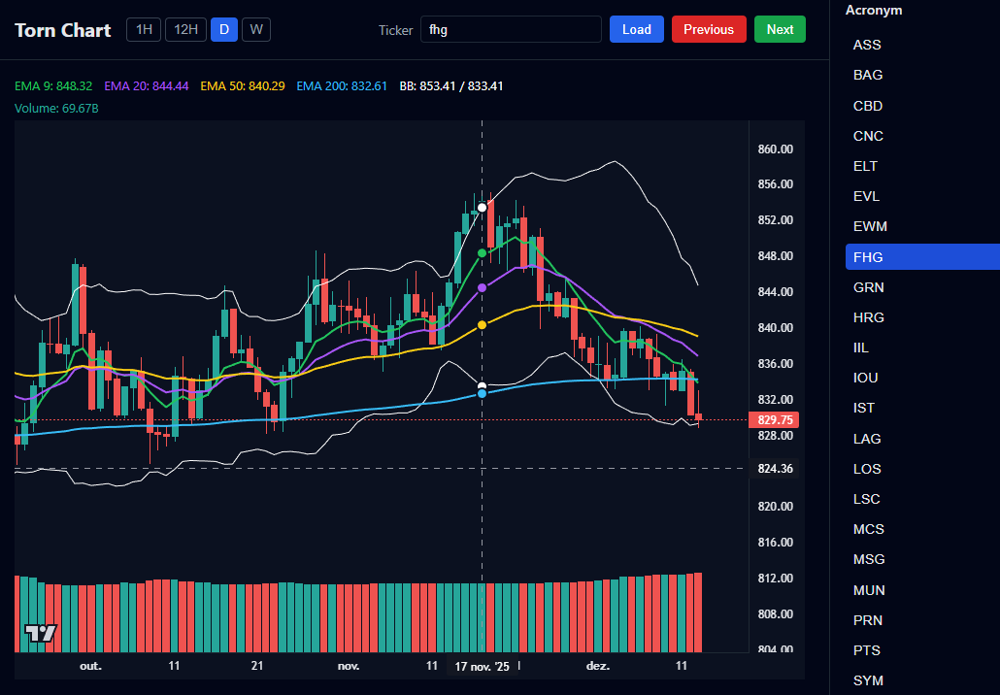

# Torn TV Chart

A professional candlestick chart application for visualizing stock market data from the Torn game. Built with modern web technologies for real-time financial analysis and technical indicators.



## Features

- **Interactive Candlestick Charts** - Price visualization with OHLC (Open, High, Low, Close) data
- **Volume Analysis** - Dedicated volume histogram with color-coded bars
- **Technical Indicators**
  - Exponential Moving Averages (EMA 9, 20, 50, 200)
  - Bollinger Bands
- **Multiple Time Intervals** - 1H, 12H, Daily (D), and Weekly (W) charts
- **Symbol Watchlist** - Quick navigation between 30+ stock symbols
- **Interactive Legend** - Click to toggle indicators on/off
- **Responsive Design** - Optimized for various screen sizes

## Technologies Used

- **React 19** - Modern UI library with hooks
- **TypeScript** - Type-safe development
- **Vite** - Lightning-fast build tool and dev server
- **Lightweight Charts** - Professional-grade charting library by TradingView
- **CSS3** - Custom styling with dark theme

## Getting Started

### Prerequisites

- Node.js 18+ and npm

### Installation

```bash
# Clone the repository
git clone <repository-url>

# Navigate to project directory
cd torn-tv-chart

# Install dependencies
npm install
```

### Development

```bash
# Start development server
npm run dev
```

Open [http://localhost:5173](http://localhost:5173) in your browser.

### Build

```bash
# Build for production
npm run build

# Preview production build
npm run preview
```

## Usage

1. **Select a Symbol** - Click on any stock symbol in the right sidebar
2. **Change Time Interval** - Use the interval buttons (1H, 12H, D, W) at the top
3. **Toggle Indicators** - Click on any indicator in the legend to show/hide it
4. **Navigate** - Use Previous/Next buttons to cycle through symbols
5. **Zoom & Pan** - Scroll to zoom, drag to pan the chart
